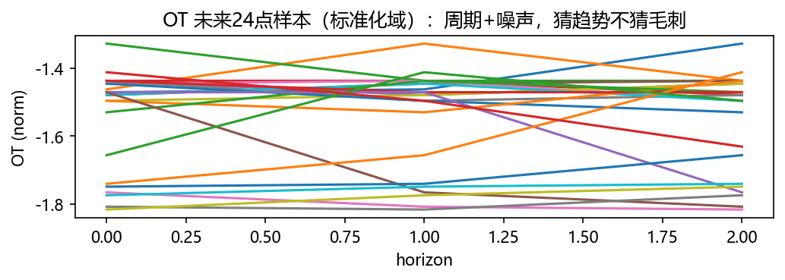
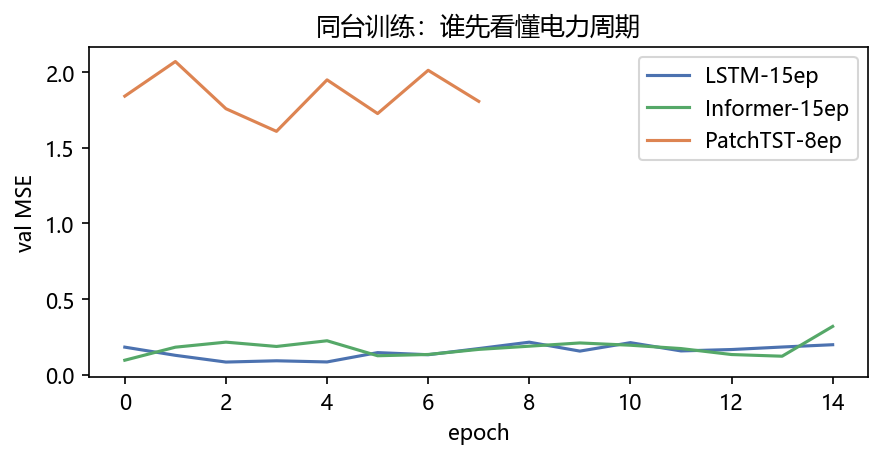
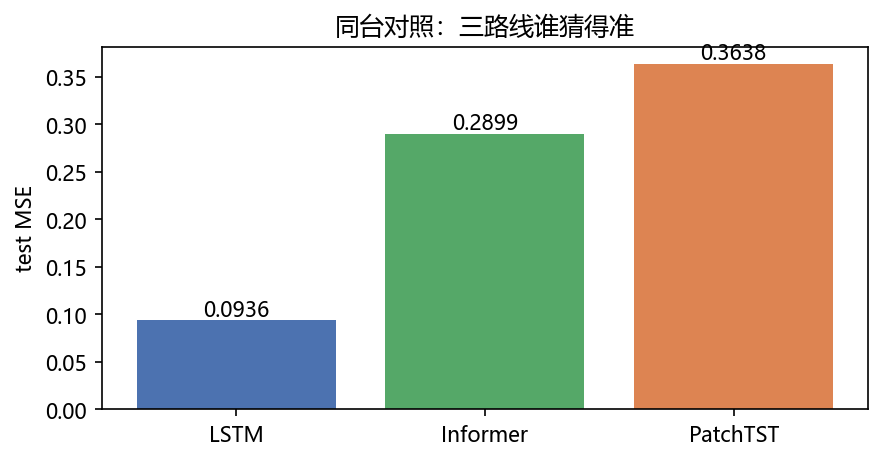
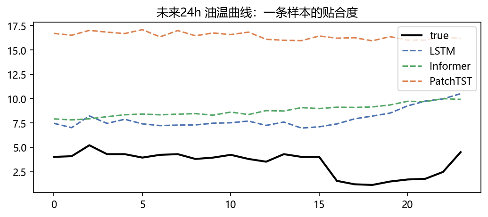

# 01 · TimeSeries ETT —— 看天看表，猜明天多少度

> 家族：`09_Domain_Models` | 状态：✅ 已完成 | 主载体：`main.ipynb` | 公共模块：`../common/`
> 环境：`LLM_learning`（torch 2.5.1+cpu；ETTh1.csv 本地真数据 17,420×8；LSTM/Informer/PatchTST 实跑约 13 分钟 CPU；无外网）
> 结论前置：**LSTM test-MSE=0.0936 / OT-RMSE=2.554℃ 胜 Informer 0.2899/4.495℃ 与 PatchTST 0.3638/5.035℃；这是同一 toy 规模、同一 15/8ep 训练口径，不是论文 SOTA**

## 1. 任务背景与目标

09 领域应用第一站：把 04 的 LSTM、05 的 Attention 迁到电力时序。使用 ETTh1 小时级变压器温度数据，过去 96 小时（4 天）输入，预测未来 24 小时（1 天）油温 `OT`。三路线同台：顺序记忆 LSTM、稀疏注意力 Informer 简化版、Patch 化 PatchTST 简化版。

## 2. 模型/算法原理

### 通俗理解

**一句话**：LSTM 像逐字默读（一页一页翻，看到 96 页猜后 24 页）；Informer 像跳读（只看关键词 top-u）；PatchTST 像剪报（剪成 16 格一块看，每种电表分开看再融合）。

**边界先说**：本章是 CPU 可复现实验。Informer 的 `ProbSparseAttention` 对 `QKᵀ` 分数仍做了完整计算，只把 value 聚合限制在 top-u，体现“稀疏选择”机制但不冒充生产级 O(L log L) kernel；PatchTST 是教学简化版，真实模型还会有更完整的 patch/channel head 设计。

### 结构账

```
数据： ETTh1 小时级 17420×7（6 负载+油温 OT），只猜 OT 未来 24 点；滑窗 96→24
切分： 7:1:2 时序切（行 12194/1742/3484 → 窗 12075/1622/3366），只用训练段定标准化
模型： LSTM(64×2) / InformerMini(稀疏top-u+Conv蒸馏) / PatchTST(P=16,S=8,通道独立)
口径： MSE(标准化域) + 反标准化 OT(℃) RMSE 双报；Adam 1e-3；LSTM/Informer 15ep，PatchTST 8ep
```

## 3. 网络结构图


| 模型 | 参数量 | 机制 |
|---|---:|---|
| LSTM | 53,528 | 顺序状态压缩 |
| InformerMini | 47,960 | top-u value 聚合 + Conv 下采样 |
| PatchTSTMini | 102,616 | P=16/S=8，通道独立共享编码器 |

## 4. 核心公式

| 公式 | 含义 |
|---|---|
| `X_t=[x_{t-95},…,x_t] → y_t=[OT_{t+1},…,OT_{t+24}]` | 96→24 滑窗 |
| `z=(x-μ_train)/(σ_train+1e-6)` | 只用训练段统计量标准化，防泄漏 |
| `u=min(L, max(8, 5·ln(L+1)))` | Informer 简化 top-u 数量 |
| `MSE=mean((ŷ-y)²)` | 标准化域测试指标 |
| `RMSE_℃=√MSE·σ_OT,train` | 反标准化可解释误差 |

## 5. 数据集

`ETTh1.csv` 已由用户下载至 `01_TimeSeries_ETT/data/ETTh1.csv`：17420 行、`date` + 7 个 float 特征（`HUFL/HULL/MUFL/MULL/LUFL/LULL/OT`），时间从 `2016-07-01 00:00` 到 `2018-06-26 19:00`，无 NaN。数据按时间顺序 70/10/20 切分，窗口不跨 split；训练段 `μ/σ` 不泄漏到拟合之外。

## 6. 训练过程与超参数

| 项 | 取值 |
|---|---|
| 输入/输出 | 96 小时 / 24 小时，7 变量输入、OT 单变量输出 |
| LSTM | hidden=64，layers=2，53,528 参，15ep |
| InformerMini | dim=64，heads=4，top-u，Conv stride=2，47,960 参，15ep |
| PatchTSTMini | patch=16，stride=8，dim=64，depth=2，102,616 参，8ep |
| 优化器 | Adam，lr=1e-3，batch=128，CPU |

PatchTST 单 epoch 明显慢于前两个模型，本轮按“训练时间可接受 + 结果可比”取 8ep；README 不把不同 epoch 包装成严格训练预算公平。

## 7. 实验结果（实跑输出）

| 模型 | test-MSE（标准化） | OT-RMSE（℃） |
|---|---:|---:|
| **LSTM** | **0.0936** | **2.554** |
| InformerMini | 0.2899 | 4.495 |
| PatchTSTMini | 0.3638 | 5.035 |

**结论**：在这份 ETTh1、96→24、CPU toy 训练口径下，LSTM 最好。原因不是“LSTM 永远胜 Transformer”，而是本实验的 Informer/PatchTST 都是简化小模型，且电力序列短窗口、样本量有限，LSTM 的强时序归纳偏置更匹配。

### 可视化






## 8. 误差分析与可视化

- **Informer/PatchTST 反而更差**：不是理论失败；本章简化 Informer 的分数计算仍是 dense，PatchTST 通道融合也只是平均，二者没吃到完整架构收益；小数据/短窗口下 LSTM 先验更强
- **训练曲线后期 val 回升**：LSTM train 继续下降但 val 15ep 已回升，存在过拟合；真实项目应早停、滚动验证、调窗口和 weight decay，而不是盲目加 epoch
- **指标双口径**：MSE 是标准化域，RMSE 乘训练段 OT 标准差后回到摄氏度；不要拿标准化 MSE 与原始温度误差混比
- **Informer 的“稀疏”口径**：top-u 限制了 value 聚合，但本 toy 仍完整算 `QKᵀ`；生产 Informer/Flash kernel 才能真正省 FLOPs/IO。本 README 明确写边界，避免教学代码冒充论文实现
- **PatchTST 的通道独立**：共享编码器逐通道处理，再平均融合；真实 PatchTST 通常会使用更细致的 head/channel mixing，结果不能直接当论文基线

### 常见坑 FAQ

1. **随机打乱时序再切 train/test**——未来泄漏；必须先按时间切，再各段滑窗
2. 用全数据 `mean/std` 标准化——测试信息泄漏；只用训练段统计量
3. 输出维度错——这里是 `(B,24)`，不是 `(B,24,7)`；目标明确只预测 OT
4. 把 Informer toy 的 top-u 当完整 ProbSparse——本章保留机制直觉，复杂度声明必须诚实
5. 用一个短窗结论否定 LSTM/Transformer——ETT 结果高度依赖 horizon、变量数、容量、训练预算
6. 只看标准化 MSE——工程汇报还要报 `OT-RMSE(℃)`，否则业务方无法解释

## 9. 总结与改进方向

**实际应用场景**

- **电力/设备预测性维护**：变压器油温预测用于过热预警；输入可加入天气、负载、节假日特征
- **Informer/PatchTST 的生产路线**：长序列、长 horizon、多变量时才更有价值；短窗小数据先用 LSTM 做强基线
- **改进路径**：rolling-origin 验证、早停、ProbSparse 真稀疏 kernel、PatchTST 完整 head、概率预测/区间预测

**核心收获**

1. 真实 ETTh1 数据闭环：加载、按时间切分、防泄漏标准化、滑窗
2. 04 的 LSTM 与 05 的 Attention 迁移到时序，三模型同台 MSE/RMSE
3. 实验结果支持“模型选择看任务与工程口径”，不是看模型名气
4. 衔接 09：下一站推荐系统（DeepFM/DIN），再之后语音 Whisper

**下一步**

- `02_Recommendation_MovieLens`：MovieLens-100K，LR/FM/DeepFM/DIN AUC 对比（需用户手动下载）

## 10. 场景速查（实践推荐）

| 场景 | 推荐 | 本章支撑 | 要点 |
|---|---|---|---|
| 短窗/中小数据 | LSTM 先做基线 | OT-RMSE 2.554℃ | 归纳偏置强、训练快 |
| 长序列/长 horizon | Informer 系列 | top-u 机制 | 生产需真稀疏实现 |
| 周期 patch 明显 | PatchTST | P=16/S=8 | 通道独立，需调 patch |
| 业务汇报 | MSE+摄氏 RMSE | 双口径 | 标准化指标不够直观 |
