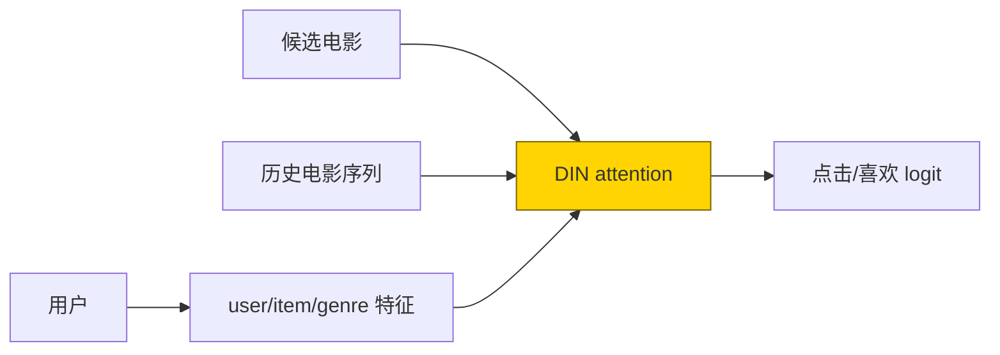
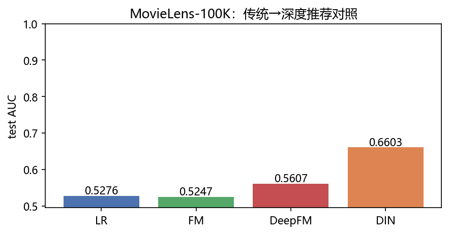
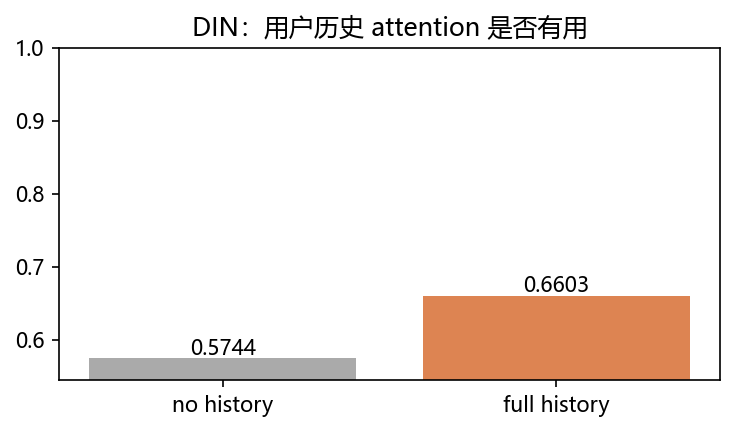

# 02 · Recommendation MovieLens —— 不是猜你喜欢，是你为什么会喜欢

> 家族：`09_Domain_Models` | 状态：✅ 已完成 | 主载体：`main.ipynb` | 公共模块：`../common/`
> 环境：`LLM_learning`（torch 2.5.1+cpu；MovieLens-100K 真数据；LR/FM/DeepFM/DIN 各 5ep，全程约 60s CPU；无外网）
> 结论前置：**DIN test-AUC=0.6603，胜 DeepFM 0.5607、LR 0.5276、FM 0.5247；拿掉用户历史后 DIN=0.5744，历史 attention 增益 +0.0859**

## 1. 任务背景与目标

09 领域应用第二站：把 01 的“时间顺序”换成推荐里的“用户行为顺序”。使用 MovieLens-100K 的用户、电影和 genre 多热特征，比较传统 LR/FM 与 DeepFM/DIN：模型是否能学特征交叉？候选电影对用户历史行为做 attention 是否真的有用？

## 2. 模型/算法原理

### 通俗理解

**一句话**：LR 像给用户和电影各打一个分；FM 像算“这个人×这部片”的二人关系；DeepFM 让小脑袋自动学组合；DIN 像翻你的历史片单，看到候选电影和哪段经历最像就加权。

**比喻**：用户历史是购物车，候选电影是手里的新商品；DIN 不把购物车平均，而是先问“哪些旧商品和这部候选最像”，相似的权重大。

### 结构账

```
数据： MovieLens-100K u1.base/u1.test；rating≥4 正样本；每个正样本采3个未看负样本
切分：官方 u1.test 做 test；u1.base 每用户最后一条留 val，防时间泄漏
模型：LR（一次项）/ FM（二阶）/ DeepFM（FM+DNN）/ DIN（候选-历史 attention）
口径：BCEWithLogitsLoss，AUC；user/item embedding dim=16，5ep
```

## 3. 网络结构图



| 模型 | 参数量 | 核心能力 |
|---|---:|---|
| LR | 2,646 | 一次项 |
| FM | 44,950 | 二阶显式交叉 |
| DeepFM | 48,151 | FM + DNN 自动组合 |
| DIN | 47,618 | 候选条件历史 attention |

## 4. 核心公式

| 公式 | 含义 |
|---|---|
| `ŷ=w0+Σwi xi` | LR 一次项 |
| `1/2[(Σvi xi)^2-Σ(vi xi)^2]` | FM 二阶交叉 |
| `L=BCEWithLogits(logit,y)` | 隐式反馈二分类损失 |
| `a_j=softmax(MLP([h_j,q,h_j-q,h_j⊙q]))` | DIN 候选-历史注意力 |
| `AUC=P(score+>score-)` | 正样本排序质量，与阈值无关 |

## 5. 数据集

MovieLens-100K 已放入 `02_Recommendation_MovieLens/data/ml-100k/`：943 用户、1682 电影、100,000 条评分。使用官方 `u1.base`/`u1.test`：训练基础交互中每个用户最后一条留作验证；评分 `>=4` 记正样本，每个正样本从用户未看电影中随机采 3 个负样本。电影 `u.item` 的 19 个 genre 作为多热特征。

训练/验证/测试行数及正样本率：

| split | rows | 正样本率 |
|---|---:|---:|
| train（含负采样） | 210,250 | 0.208 |
| val（含负采样） | 2,170 | 0.188 |
| test（官方原始） | 20,000 | 0.562 |

测试集保持官方原始评分分布；训练/验证为正负采样分布，AUC 主要看排序，不将不同采样率下的概率直接比较。

## 6. 训练过程与超参数

| 项 | 取值 |
|---|---|
| Embedding | user/item dim=16，genre 投影到 16 维 |
| DIN history | 训练集每用户最近 20 个正反馈，左侧零 padding |
| 优化器 | Adam，lr=1e-3，batch=2048，5ep |
| 设备 | CPU；四模型约 60s |

- LR/FM/DeepFM 使用 user+item+genre 特征
- DIN 额外使用候选条件历史 attention；历史只从训练部分构建，不把官方 test 偷进来
- MovieLens 电影 ID 存在 1682 个目录槽位（部分电影无评分），缺失 genre 补零

## 7. 实验结果（实跑输出）

| 模型 | 参数量 | val-AUC | test-AUC |
|---|---:|---:|---:|
| LR | 2,646 | 0.5003 | 0.5276 |
| FM | 44,950 | 0.5081 | 0.5247 |
| DeepFM | 48,151 | 0.4863 | 0.5607 |
| **DIN** | **47,618** | **0.5158** | **0.6603** |

DIN 历史消融：

| 输入 | test-AUC |
|---|---:|
| 不使用历史（候选自身退化） | 0.5744 |
| 完整历史 attention | **0.6603** |
| 增益 | **+0.0859** |

**结论**：本轮真实 MovieLens 口径下，DIN 的用户历史建模是最大收益来源；DeepFM 比 LR/FM 好，说明非线性特征组合有价值；FM 在这个简单 genre 投影+短训设置下没有超过 LR，不能仅凭模型名字保证提升。

### 可视化




## 8. 误差分析与可视化

- **test 正样本率和 train 不同**：训练/验证是正样本+3负样本，官方 test 是原始评分二值化；AUC 对类比例不敏感，但不能把两边 sigmoid 概率当校准概率
- **FM 没胜 LR**：本轮 genre 是线性投影、训练只有 5ep，且没有用户历史；FM 的二阶交叉不一定有足够信号，属于真实阴性结果
- **DIN 的 +0.0859 不能全归因于 attention**：no-history 消融仍保留 DIN MLP 与 embedding，唯一主要变化是历史输入；它证明历史信息有用，但不是严格结构因果实验
- **时间泄漏边界**：history 只由训练正反馈构建；把验证/测试正样本预先放进历史会显著抬高 AUC，生产必须按时间滚动构造
- **MovieLens 是离线排序数据**：没有曝光日志、点击位置、负曝光等生产字段；AUC 适合教学排序对照，不等价于线上 CTR/NDCG

### 常见坑 FAQ

1. 把 `rating=1/2/3` 全当负样本——低评分和未曝光不是同一件事；本章用 `rating>=4` 正，其余官方 test 仅作为评估标签
2. 负样本采到用户看过的电影——会制造假负；训练采样排除了用户训练期已见 item
3. DIN 历史长度不 padding——batch 无法堆叠；本章左侧零 padding，并把 padding 映射到 item 0
4. 把官方 `u1.test` 混进 history——时间泄漏；history 仅来自 train
5. 只看 accuracy——推荐是排序问题；本章主指标 AUC
6. 把 MovieLens AUC 当线上收益——离线数据没有曝光/位置/延迟反馈，线上还需 replay、NDCG、CTR 和校准

## 9. 总结与改进方向

**实际应用场景**

- **内容推荐**：用户近期浏览/购买序列 + 候选 item，DIN attention 找兴趣相关行为
- **广告/CTR**：DeepFM 处理离散字段交叉，DIN 建模用户行为序列——工业推荐的经典组合
- **改进路径**：更严格时间切分、hard negative、NDCG/Recall@K、序列 Transformer、特征校准与线上 A/B

**核心收获**

1. LR→FM→DeepFM：从一次项到显式/隐式交叉
2. DIN 的关键不是更大的 MLP，而是候选条件历史 attention；本轮增益 +0.0859
3. 负采样/时间切分/历史构造决定离线指标可信度，模型名次不是唯一重点
4. 衔接 09：时序（01）→ 推荐（02）→ 语音（03）

**下一步**

- `03_Whisper_ASR_Experience`：Whisper tiny 真实音频转写（需要用户提供或下载音频；模型权重可能受外网影响）

## 10. 场景速查（实践推荐）

| 场景 | 推荐 | 支撑数据 | 要点 |
|---|---|---|---|
| 只有静态字段 | LR/FM | 0.5276/0.5247 | 先做强基线 |
| 字段组合复杂 | DeepFM | 0.5607 | FM+DNN |
| 有用户行为序列 | DIN | 0.6603 | 候选条件 attention |
| 生产上线 | AUC+NDCG+线上A/B | 本章仅 AUC | 离线不能代替线上 |
