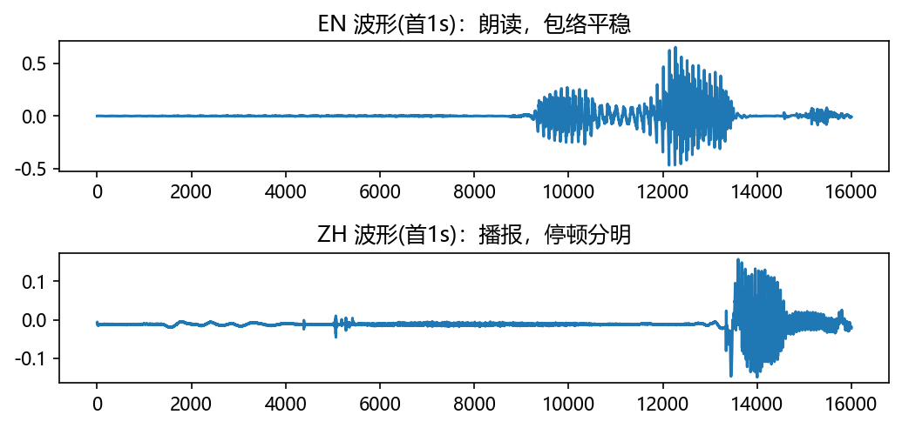
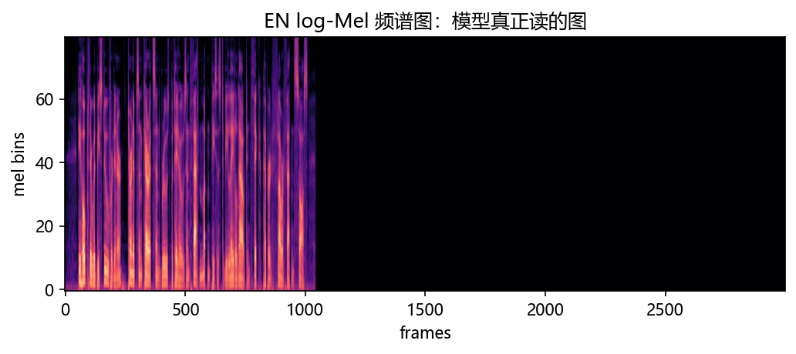
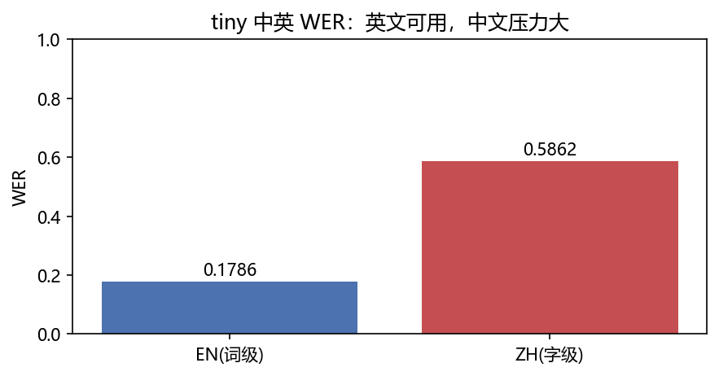

# 03 · Whisper ASR —— 给机器装耳朵，听懂中英两段

> 家族：`09_Domain_Models` | 状态：✅ 已完成 | 主载体：`main.ipynb`
> 环境：`LLM_learning`（transformers 4.47 + scipy；whisper-tiny 本地 9 文件离线加载；中英真实音频；全程约 35s CPU；无外网）
> 结论前置：**tiny 英文 WER=0.1786（可用）/ 中文字级 WER=0.5862（压力大）；forced-lang 与 auto 转写完全一致；log-Mel(1,80,3000) 链路可视化**

## 1. 任务背景与目标

09 领域应用收官站：前两站是结构化数据（表格时序/评分矩阵），本章是真实连续信号。离线加载工业级 Whisper tiny（37,760,640 参），转写一段英文朗读 + 一段中文播报，对照参考文本打 WER，并验证强制语言与自动检测是否一致。

## 2. 模型/算法原理

### 通俗理解

**一句话**：耳朵先把声波切成频谱图（看哪个频率响），再让小模型读图写字——英文像听写（词与词有空格，按词算错），中文像听写连笔字（字与字没缝，按字算错）。

**链路**：`16kHz 波形 → 80维 log-Mel(3000帧) → Encoder-Decoder Transformer → BPE 解码`。语言 token（`<|en|>/<|zh|>`）告诉解码器用什么文字写。

### 结构账

```
权重： whisper-tiny 本地 9 文件（model.safetensors 151MB + slow 分词 vocab/merges/normalizer），local_files_only 离线
音频： 英 10.44s LibriSpeech 1089-134686-0000（官方转写 28 词）/ 中 9.19s A7_87（参考 29 字）
链路： scipy读wav → processor转80维log-Mel → tiny generate(max128) → decode
口径： 英WER(词级) + 中WER(字级)；forced-lang vs auto 消融
```

## 3. 网络结构图


| 项 | 取值 |
|---|---|
| 模型 | whisper-tiny，37,760,640 参 |
| 输入 | 80维 log-Mel，最长 3000 帧（30s） |
| 解码 | greedy，max_new_tokens=128 |

## 4. 核心公式

| 公式 | 含义 |
|---|---|
| `Mel=log(‖STFT‖²·Mel滤波器)` | 频谱特征（模型真正读的图） |
| `WER=(S+D+I)/N` | 词/字错误率（替换+删除+插入） |
| `forced_ids=[lang, transcribe]` | 强制语言 token |
| `auto=detect→transcribe` | 自动检测后转写（transformers≥4.43 默认） |

## 5. 数据集

`03_Whisper_ASR_Experience/data/`（用户已放入）：

| 文件 | 说明 |
|---|---|
| `1089-134686-0000.wav` | 英文 10.44s（flac 转 wav，16k 单声道） |
| `1089-134686.trans.txt` | 英文官方转写（0000 对应 28 词长句） |
| `A7_87.wav` | 中文 9.19s（16k 单声道，峰值 0.507） |
| `A7_87.txt` | 中文参考：`本版11927 杂文受好评议文内 淮北文联 应为淮南文联 特此更正`（29 字） |

权重 `weights/whisper-tiny/` 共 9 文件（config/generation/preprocessor/tokenizer×2/vocab/merges/normalizer/model.safetensors），用户手动下载。transformers 4.47 慢速 BPE 需要 `vocab.json+merges.txt+normalizer.json`，缺一即 `TypeError: NoneType`（本轮实测踩过，已补齐）。

## 6. 转写过程与超参数

| 项 | 取值 |
|---|---|
| 加载 | `local_files_only=True`，HF/TRANSFORMERS 双离线环境变量 |
| 解码 | greedy，max_new_tokens=128 |
| 语言 | forced(`en`/`zh`) 主结果 + auto 消融 |
| 设备 | CPU；两段转写约 30s |

转写原文：

| 段 | 参考 | tiny 输出 |
|---|---|---|
| EN | HE HOPED THERE WOULD BE STEW FOR DINNER...FATTENED SAUCE | He hoped there would be stew for dinner...flour-fat and sauce. |
| ZH | 本版11927 杂文受好评议文内 淮北文联 应为淮南文联 特此更正 | 本版1927 詐文獸好評一文內 懷悲悶悶 因為懷難悶悶 特此更重 |

## 7. 实验结果（实跑输出）

| 指标 | 值 |
|---|---|
| 英文 WER（词级，28 词） | **0.1786**（5 词错：大小写不计，主错 `FATTENED→fat` + 标点） |
| 中文 WER（字级，29 字） | **0.5862**（17 字错：数字+专名+文言全崩） |
| forced vs auto | **完全一致**（EN True / ZH True） |
| log-Mel | (1, 80, 3000) |

**结论**：tiny 英文朗读可用（0.18 是 tiny 在 LibriSpeech 上的正常水平）；中文播报名词+数字+文言组合直接崩（0.59）——tiny 中文能力弱 + 无领域适配，这是模型容量问题，不是链路 bug。

### 可视化





## 8. 误差分析与可视化

- **英文 5 个错哪来**：`FLOUR FATTENED→flour-fat`（连读粘连）+ 逗号（不计分）+ 大小写（归一化不计）；28 词错 5 个即 0.1786，tiny 无语言模型纠错，正常
- **中文崩在三处**：`11927→1927`（数字串）、`淮北/淮南文联→懷悲/懷難悶悶`（专名+口音）、`杂文受好评议文内→詐文獸好評一文內`（文言+同音）。tiny 中文训练少 + 繁简混出（`獸/懷`），base 以上才稳
- **forced 与 auto 完全一致**：两段语言特征鲜明，检测器无压力；短码切换/中英混读才会分叉（消融可做）
- **权重 9 文件缺一不可**：慢速 BPE 要 vocab/merges/normalizer；只有 `tokenizer.json` 会报 `NoneType`——transformers 4.47 实测
- **英文 flac 读不了**：`soundfile` 未装 + `torchaudio` 后端空；用户转 wav 解决（`ffmpeg -ar 16000 -ac 1`），notebook 只用 scipy 读 wav，零新依赖

### 常见坑 FAQ

1. 在线 `from_pretrained('openai/whisper-tiny')`——本机连 HF 无响应 3 分钟；必须本地权重 + `local_files_only`
2. 只下 6 个文件缺 vocab/merges——慢速分词初始化 `NoneType`；9 文件清单见 §5
3. 中文按词算 WER——中文无空格，先按字算；要词级先分词（jieba）
4. 拿 tiny 中文 WER 当 Whisper 不行——tiny 39M 中文弱；base/small 中文才可用，large 才生产
5. flac 直接喂 scipy——`scipy.io.wavfile` 只读 wav；先转 wav 或装 soundfile
6. attention mask 警告——pad==eos 的已知警告，不影响 greedy 短转写；长音频要传 mask+分段

## 9. 总结与改进方向（09 家族收官）

**实际应用场景**

- **会议/播报转写**：base+large + 领域词表 + 说话人分离——本章是 tiny 最小链路
- **09 家族一句话**：时序看表（01 LSTM 胜 toy Transformer）→ 推荐看人（02 DIN 历史 +0.0859）→ 语音听声（03 tiny 英可用中承压）
- **改进路径**：large-v3 + 繁简归一 + 数字/专名热词 + 流式切分——生产四件套

**核心收获**

1. 真实音频闭环：wav 解码 → log-Mel → tiny → WER，全链路离线可复现
2. 中英双 WER：0.1786 vs 0.5862——容量与语言覆盖的实测差距
3. forced/auto 一致 + 频谱可视化——链路正确双证据
4. 09 收官：领域×主干三站（时序/推荐/语音）齐了

**下一步**

- 09 家族总检 + 推送（由用户执行）
- 全路线 01~09 主干收官

## 10. 场景速查（实践推荐）

| 场景 | 推荐 | 支撑数据 | 要点 |
|---|---|---|---|
| 英文朗读/会议 | tiny/base | WER 0.18 | 短句可用 |
| 中文播报/专名多 | base 以上+热词 | tiny 0.59 崩 | 容量+领域适配 |
| 离线/无网 | 本地权重+local_files | 本章全离线 | 9 文件清单 |
| 语言混杂 | auto 检测 | 本轮一致 | 短码切换再测 |
